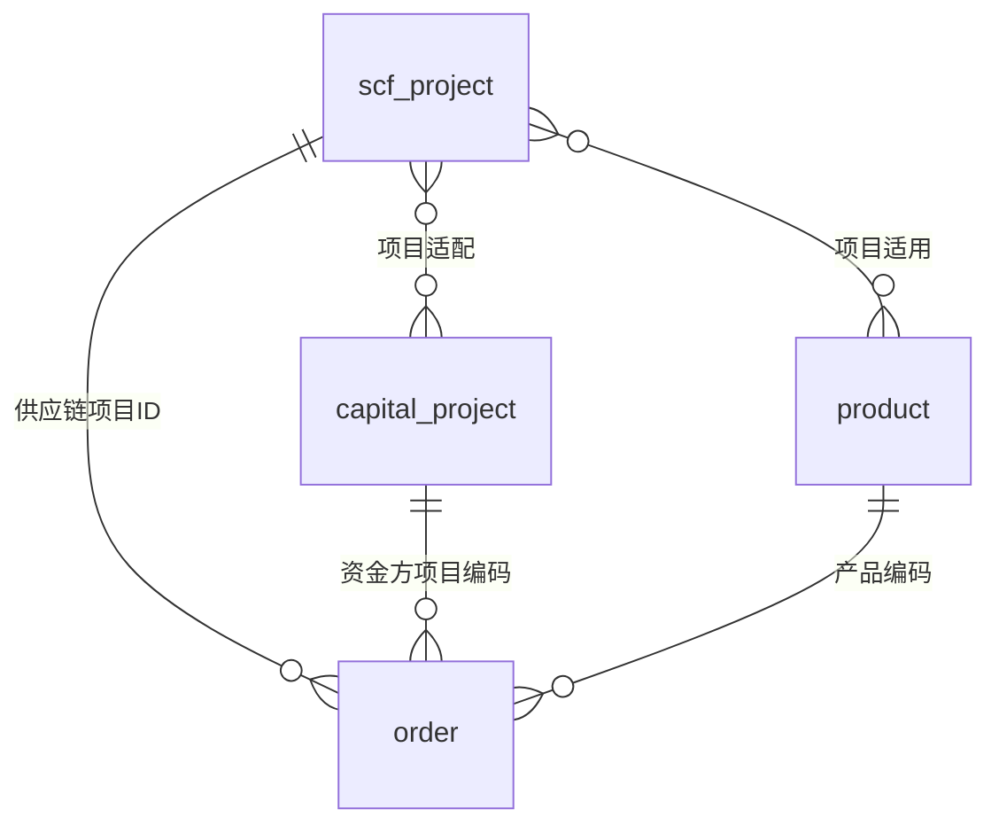

## 借款订单字段最小方案

### 目标
在供应链金融场景下，为每笔借款订单同时保留业务维度、资方维度与行业场景维度，确保路由、额度、对账与统计口径一致。

### 订单必须记录的最小字段
- product_code：产品编码
- capital_project_code：资金方项目编码
- scf_project_id：供应链项目ID

### 字段含义与作用
- product_code：业务产品维度，用于产品配置、统计口径与产品级风控限制
- capital_project_code：资方维度，用于路由选择、资方额度、资方对账
- scf_project_id：供应链行业场景维度，用于区分医药/汽配等场景及借款主体属性

### 关联关系建议
- scf_project_id 与 product_code：一对多或多对多，取决于同一供应链项目是否允许多个产品
- scf_project_id 与 capital_project_code：多对多，通过映射表维护资方与项目的适配关系
- order 与 scf_project_id / capital_project_code / product_code：一对一记录在订单表中

### 关系示意图

### 为什么不合并维度
- 资金项目是资方维度，不承载行业与借款主体属性
- 供应链项目是行业场景维度，应独立于资方维度
- 产品是业务维度，独立于资方与行业维度

### 典型场景示例
一笔“医院供应链”订单可能落在：
- product_code：医药供应链产品
- scf_project_id：医药供应链项目
- capital_project_code：某资方在医药行业的资金项目
