# 资金路由模块表结构梳理（以 t_route_capital_config 为核心）

本文基于 [核心系统表结构.md](file:///d:/IdeaProjects/scf-loan/docs/design/%E6%A0%B8%E5%BF%83%E7%B3%BB%E7%BB%9F%E8%A1%A8%E7%BB%93%E6%9E%84.md) 中的路由相关表，围绕 `t_route_capital_config` 梳理资金路由模块的核心表族、关键字段与数据流转。

## 1. 范围与核心表族

资金路由模块以 **t_route_capital_config** 为中心，围绕“资方配置 → 资方分组 → 路由实例 → 预筛/策略 → 费率与头寸 → 产品与枚举”形成闭环：

1. **核心资方配置族**：`t_route_capital_config`、`t_route_sub_capital_config`、`t_route_guarantor_info`
2. **资方分组与路由池族**：`t_route_capital_group`、`t_route_capital_group_mapping`、`t_route_capital_list`
3. **路由实例与预筛族**：`t_route_info`、`t_route_pre_check_info`、`t_route_pre_check_detail_info`、`t_route_pre_check_rules`、`t_route_pre_details`
4. **策略与规则族**：`t_route_policy_info`、`t_route_policy_rule`、`t_route_policy_rule_rel`、`t_route_policy_rule_express`、`t_route_policy_execution_details`、`t_route_policy_field_definition`
5. **费率与异常族**：`t_route_decision_rate_param`、`t_route_param_exception_stat`
6. **产品与头寸族**：`t_route_product_config`、`t_route_product_enum`、`t_route_product_module`、`t_route_sign_limit_amt`、`t_route_sign_limit_upload_file`、`t_route_plan`、`t_route_cash_reuse_criteria`、`t_route_cash_transfer_criteria`

## 2. 关键表逐表梳理（字段与关系要点）

**t_route_capital_config（资产/资方主配置）**  
描述资方/资金模式的基础能力与路由规则，决定是否参与路由及前置要求。关键字段：`capital_project_code`、`product_code/sub_product_code`、`enable_flag`、`status`、`required_inq_credit`、`required_sign_nucc`、`rate_range`、`pre_approval_start_time/pre_approval_end_time`。

**t_route_sub_capital_config（子资金模式）**  
资方配置的子模式，承载担保方、签约主体、年化利率等信息。关系：`capital_project_config_id` → t_route_capital_config.id；`guarantor_id` → t_route_guarantor_info.id。

**t_route_capital_group / t_route_capital_group_mapping（资方分组）**  
将资方配置聚合为路由池。`t_route_capital_group_mapping.capital_config_id` 关联到 t_route_capital_config.id，并可配置 `priority`。

**t_route_info（路由实例主表）**  
一次路由的主记录，`route_auth_token` 为全链路主键。记录 `route_status`、`cur_position`、`apply_amount/period` 等状态与上下文。

**t_route_capital_list（路由候选池明细）**  
存储某次路由中各资方的候选位置、预审状态、申请流水号等。关系：多对一 → t_route_info；资方维度通过 `capital_project_code` 关联 t_route_capital_config。

**t_route_pre_check_info / detail / rules（预筛）**  
配置与执行预筛规则。`t_route_pre_check_rules` 按 `capital_config_id` 配置，执行结果落在 `t_route_pre_check_info` 与 `t_route_pre_check_detail_info`。

**策略与规则族**  
`t_route_policy_info` 管策略版本；`t_route_policy_rule`/`rule_express` 表达规则条件；`t_route_policy_rule_rel` 将策略与规则关联；`t_route_policy_execution_details` 记录执行轨迹；`t_route_policy_field_definition` 定义可配置字段与取值来源。

**费率与异常族**  
`t_route_decision_rate_param` 保存费率决策出参；`t_route_param_exception_stat` 记录预审参数异常类型与级别。

**产品与头寸族**  
产品配置由 `t_route_product_config/enum/module` 描述；资方头寸由 `t_route_sign_limit_amt` 管理，并用 `t_route_sign_limit_upload_file` 记录上传文件；`t_route_plan` 记录资金计划；`t_route_cash_reuse_criteria` 与 `t_route_cash_transfer_criteria` 描述头寸复用/转移条件。

## 3. 资金路由数据流转（表间关系与流程）

1. **资方与产品配置准备**  
运维或配置侧维护 `t_route_capital_config`、`t_route_sub_capital_config`、`t_route_guarantor_info`，并按产品配置 `t_route_product_config/enum/module`。头寸额度在 `t_route_sign_limit_amt` 与 `t_route_plan` 中维护，必要时通过 `t_route_sign_limit_upload_file` 记录导入。

2. **路由实例创建**  
当用户进入路由流程，系统创建 `t_route_info`，生成 `route_auth_token`，并初始化路由状态、当前位置、申请金额与期次。

3. **资方候选池构建**  
根据产品与资方分组配置，从 `t_route_capital_group` / `t_route_capital_group_mapping` 选出候选资方，写入 `t_route_capital_list`，设置 `position` 与初始 `audit_status`。

4. **预筛规则执行**  
按 `t_route_pre_check_rules` 和 `t_route_policy_field_definition` 进行预筛，结果写入 `t_route_pre_check_info` / `t_route_pre_check_detail_info`，并在 `t_route_capital_list.skip_reason` 中记录跳过原因。

5. **策略与规则计算**  
策略引擎读取 `t_route_policy_info` / `rule` / `rule_express` / `rule_rel`，执行结果写入 `t_route_policy_execution_details`。若有异常参数，记录至 `t_route_param_exception_stat`。

6. **查征与费率决策**  
按 `required_inq_credit` 决定是否查征，结果入 `t_route_credit_info`。费率决策输出保存至 `t_route_decision_rate_param`，必要时依据 `rate_range` 或 `monthly_rate_flag` 调整候选排序或剔除。

7. **头寸与额度校验**  
根据 `t_route_sign_limit_amt`、`t_route_plan` 与 `t_route_cash_reuse_criteria` / `t_route_cash_transfer_criteria` 校验资方头寸可用性，更新 `t_route_capital_list` 的状态与排序。

8. **路由结果沉淀**  
最终选中的资方位置反映在 `t_route_info.cur_position` 与 `route_status`，并在 `t_route_capital_list` 中保留每家资方的状态、申请流水与拒绝原因，为后续授信/放款链路提供依据。

## 4. ER 图（资金路由核心关系）

```mermaid
erDiagram
    t_route_capital_config ||--o{ t_route_sub_capital_config : "has"
    t_route_guarantor_info ||--o{ t_route_sub_capital_config : "guarantees"

    t_route_capital_group ||--o{ t_route_capital_group_mapping : "maps"
    t_route_capital_config ||--o{ t_route_capital_group_mapping : "belongs_to"

    t_route_info ||--o{ t_route_capital_list : "candidates"
    t_route_capital_config ||--o{ t_route_capital_list : "selected_by"

    t_route_info ||--o{ t_route_pre_check_info : "precheck"
    t_route_pre_check_info ||--o{ t_route_pre_check_detail_info : "details"
    t_route_capital_config ||--o{ t_route_pre_check_rules : "rules"
    t_route_capital_config ||--o{ t_route_pre_check_detail_info : "precheck_by"

    t_route_policy_info ||--o{ t_route_policy_rule_rel : "links"
    t_route_policy_rule ||--o{ t_route_policy_rule_rel : "links"
    t_route_policy_rule ||--o{ t_route_policy_rule_express : "expresses"
    t_route_policy_info ||--o{ t_route_policy_execution_details : "executes"

    t_route_info ||--o{ t_route_credit_info : "credit"
    t_route_info ||--o{ t_route_decision_rate_param : "rates"
    t_route_info ||--o{ t_route_param_exception_stat : "exceptions"

    t_route_product_enum ||--o{ t_route_product_module : "modules"
    t_route_product_enum ||--o{ t_route_product_config : "config"
    t_route_product_module ||--o{ t_route_policy_product_rel : "policy_applies"

    t_route_capital_config ||--o{ t_route_sign_limit_amt : "limits"
    t_route_sign_limit_amt ||--o{ t_route_sign_limit_upload_file : "uploads"
    t_route_capital_config ||--o{ t_route_plan : "plans"
    t_route_capital_config ||--o{ t_route_cash_reuse_criteria : "reuse"
    t_route_capital_config ||--o{ t_route_cash_transfer_criteria : "transfer"
```

