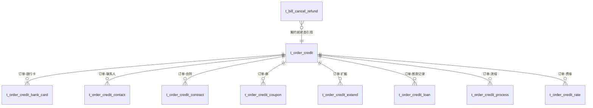

# t_order_credit 相关订单表架构说明

## 范围
- 核心表：t_order_credit
- 附属表：t_order_credit_bank_card、t_order_credit_contact、t_order_credit_contract、t_order_credit_coupon、t_order_credit_extend、t_order_credit_loan、t_order_credit_process、t_order_credit_rate
- 配置表：t_order_credit_message_config、t_order_credit_rule_config
- 关联表：t_bill_cancel_refund

数据来源：[核心系统表结构.md](file:///d:/IdeaProjects/scf-loan/docs/design/核心系统表结构.md#L1827-L2072)

## 核心表
### t_order_credit（信贷订单表）
- 主键：id
- 唯一约束：order_id
- 订单维度字段：order_id、order_status、flow_id、process_id
- 产品与资方维度：product_code、fund_code、fund_source、capital_project_code、sub_capital_project_code
- 业务要素：amount、period、period_type、loan_purpose、loan_action_type、loan_date
- 风控与拒绝原因：risk_loan_type、reason_code、terminate_reason
- 订单生命周期：sign_date、clear_date

表定义：[核心系统表结构.md:t_order_credit](file:///d:/IdeaProjects/scf-loan/docs/design/核心系统表结构.md#L1827-L1866)

## 附属表
- t_order_credit_bank_card：订单与银行卡关系，按用途区分放款/还款
- t_order_credit_contact：订单联系人关系
- t_order_credit_contract：订单合同列表
- t_order_credit_coupon：订单营销券关系
- t_order_credit_extend：订单扩展属性键值集合
- t_order_credit_loan：订单放款执行记录
- t_order_credit_process：订单流程节点与状态
- t_order_credit_rate：订单费率集合

表定义：
- [t_order_credit_bank_card](file:///d:/IdeaProjects/scf-loan/docs/design/核心系统表结构.md#L1868-L1882)
- [t_order_credit_contact](file:///d:/IdeaProjects/scf-loan/docs/design/核心系统表结构.md#L1884-L1897)
- [t_order_credit_contract](file:///d:/IdeaProjects/scf-loan/docs/design/核心系统表结构.md#L1899-L1914)
- [t_order_credit_coupon](file:///d:/IdeaProjects/scf-loan/docs/design/核心系统表结构.md#L1916-L1929)
- [t_order_credit_extend](file:///d:/IdeaProjects/scf-loan/docs/design/核心系统表结构.md#L1931-L1949)
- [t_order_credit_loan](file:///d:/IdeaProjects/scf-loan/docs/design/核心系统表结构.md#L1951-L1972)
- [t_order_credit_process](file:///d:/IdeaProjects/scf-loan/docs/design/核心系统表结构.md#L1989-L2012)
- [t_order_credit_rate](file:///d:/IdeaProjects/scf-loan/docs/design/核心系统表结构.md#L2014-L2029)

## 配置表
- t_order_credit_message_config：按资方维度维护放款失败原因映射
- t_order_credit_rule_config：按资方与附属产品维度维护规则匹配

表定义：
- [t_order_credit_message_config](file:///d:/IdeaProjects/scf-loan/docs/design/核心系统表结构.md#L1974-L1987)
- [t_order_credit_rule_config](file:///d:/IdeaProjects/scf-loan/docs/design/核心系统表结构.md#L2031-L2042)

## 关联表
- t_bill_cancel_refund：解约退款信息，包含解约前状态，引用 t_order_credit.order_status

表定义：[t_bill_cancel_refund](file:///d:/IdeaProjects/scf-loan/docs/design/核心系统表结构.md#L179-L197)

## 关系图

## 架构要点
- t_order_credit 以 order_id 作为业务唯一键，其他表通过 order_id 进行归集
- 流程与放款执行拆分为独立表，保证订单状态与执行记录解耦
- 扩展字段与配置表分离，便于按资方与产品策略调整
